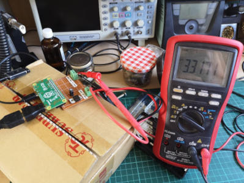
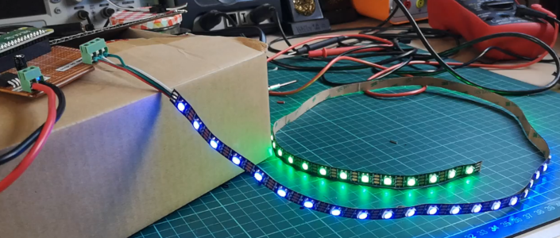
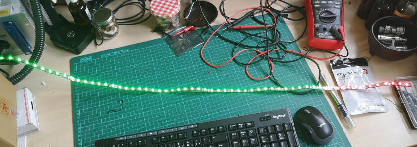
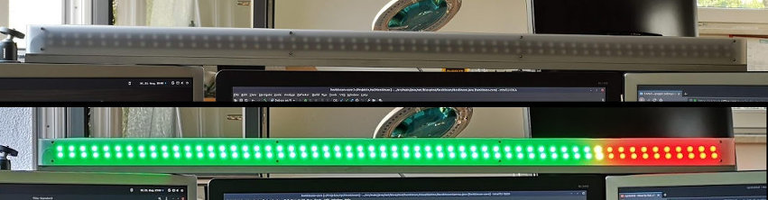

# Henkinson - Status Display for Jenkins

## The Back Story
I am an IT guy, and my current assignment (as of August 2018) is one as a software development governance guy. You know, the one who processes pull requests, configures Sonar rules, makes sure the guidelines are respected etc. You know, this guy here:

Now, I obviously keep a close eye on our Jenkins server. Whenever a build turns red, so do I. I just don't think the UI is nice enough to warrant staring at it all the time, so I wanted something better. Something nicer. Something so fucking nerdy that the boss starts crying when he sees it. I wanted the Henkinson.

## What is the Henkinson?
The Henkinson is a Raspberry Pi Zero W. It has an LED strip with those nifty WS2812 thingies connected to GPIO18. It has a power supply. It has a VPN connection to our build environment. And it has the code from this repo running on it. The effect of all of these nice things is that the LED strip acts as a VU meter which displays the ratio of red, yellow and green master branches on the Jenkins server at any given point in time. I personally think that this is cool as hell.

At the time of writing, the hardware wasn't done yet. Instead of being nice and clean and Star-Trek-Like, it's a box with wires and a puny 1m strip of LEDs. It looks like this right now:

 
 
 
 
 

 

I will add more images when I have built some kind of case for the electronics and a nice thingie for the strip.

## How to Use This?
You copy the JAR generated by the maven build, which will be called `henkinson-full.jar` to some directory on your Pi. You take the systemd service from the etc-folder of this repo and copy it to the right location. You edit it so it contains the proper paths. You take the `henkinson.conf` file from the etc-folder and copy it to the etc-folder of your Pi. You edit it so it contains the proper data. You ask yourself how to activate the service and which is the "right" directory to put it. You google "create systemd service". You have learned a valuable lesson about Linux. You start the service. You enjoy the pretty lights.

## How to Report Bugs and Stuff?
Take a close look at this Github page. You'll see a thing called "issues". That's an issue tracker. Use it. I might even look at what you post there, but don't hold your breath. I've got a day job, you know, and somebody who actually has any use for this project is expected by me to be able to cope with most problems himself.

## Can I Participate?
Sure. Fork it, change it, send me a pull request.

## Why Does the Code Look Like Shit and Why Don't You Write Tests?
Because my day job deals with quality assurance. I'm fed up with that stuff when I come home, and in my spare time I write shitty code _because I can_. Feel free to add whatever you think belongs there, but don't expect me to do it.

## Thanks
I wouldn't have started this project if it hadn't been for the great Diozero library (https://github.com/mattjlewis/diozero) that provides a Java API for the Raspberry Pi. I can't stand Python, I prefer papercuts to C and to be honest, I only like Java. Thanks, Matt, for giving this lib to me. But please stop using System.out for logging purposes, that stuff makes my skin crawl.   
